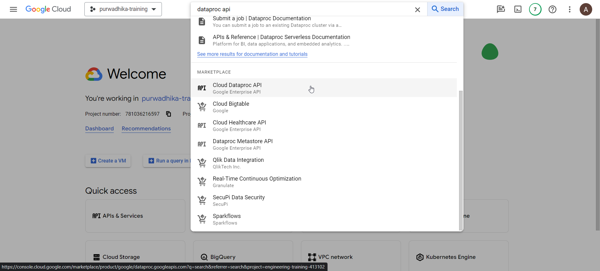
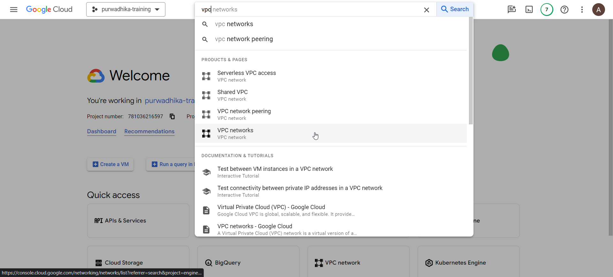
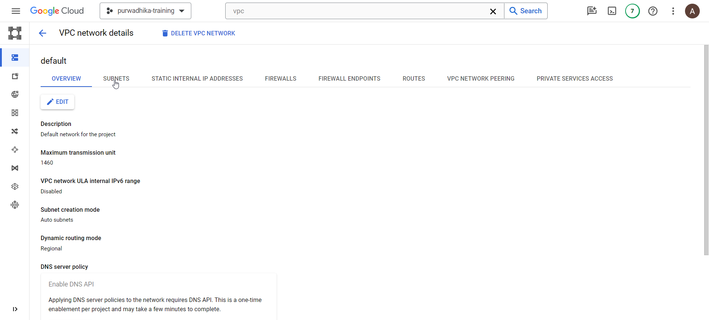
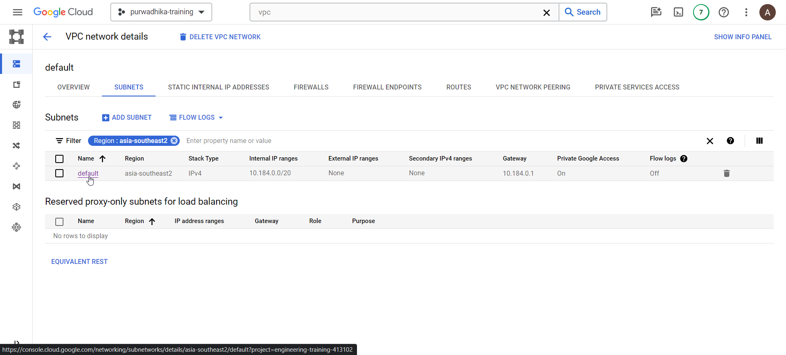

# Data Processing with Dataproc Serverless

## Enable APIs (Don't show to students)

- Dataproc API

  

- Click on `ENABLE`

## Configure network connectivity (Don't show to students)

- Go to VPC Networks

  

- Click on `default` network

  

- On the `default` network details, click on `SUBNETS` tab

  

- Look for subnet in the region `asia-southeast2` or other region you want to use for dataproc serverless

  

- Click on the `default` subnet and click on `EDIT`

  

- Enable private google access

  

- Save the changes

## Prepare prerequisites

- Make sure git and wget is available on your cloud shell

  ```bash
  git --version
  wget --version
  ```

- Next clone the git repo:

  ```bash
  git clone https://<personal-access-token>@github.com/etchzel/dataproc-batch.git
  cd dataproc-batch
  ```

- Run the script `download_to_gcs.sh` to prepare the data

  ```bash
  chmod +x download_to_gcs.sh
  ./download_to_gcs.sh /home/<username>/dataproc-batch gs://trainer_gcs_001/dataproc/input
  ```

- Next copy the file `spark_job.py` to GCS

  ```bash
  gcloud storage cp spark_job.py gs://trainer_gcs_001/dataproc/spark_job.py
  ```

## Run Serverless Spark Job

- In the GCP Console, go to Dataproc page

  

- Expand the sidebar and click on `Batches`

  

- Click on `CREATE`

  

  

- Change region to `asia-southeast2` or whatever region you set up network private access with, and change `Batch type` under `Container` section to `PySpark`

  

- Under `Main python file` enter the path to the main python file

  
  
  (OPTIONAL) if you want to add python dependencies, you need to package all the python dependencies as zip file, or use custom container (for external dependencies as well)
  
  - Under `Additional python files` enter the path to the zipped python dependencies

    ```bash
    mkdir utils
    pip install <pypi-dependencies> <pypi-dependencies> --target=utils/
    cd utils
    zip -r dependencies.zip .
    gcloud storage cp dependencies.zip gs://trainer_gcs_001/dataproc/dependencies.zip
    ```

  - Under `Custom container images` enter the path to Artifact Registry of your container image

    ```bash
    asia-southeast2-docker.pkg.dev/engineering-training-413102/${AF_REPO_NAME}/${IMAGE_NAME}:${IMAGE_VERSION}
    ```

- Scroll below, under `Arguments` field, enter the following args line by line

  ```bash
  --input_green=gs://trainer_gcs_001/dataproc/input/green_tripdata_*.parquet
  --input_yellow=gs://trainer_gcs_001/dataproc/input/yellow_tripdata_*.parquet
  --output=${DATASET_NAME}.${TABLE_NAME}
  --temp_bucket=trainer_gcs_001/dataproc/temp
  ```

  

- Scroll below again, under `Network Configuration`, make sure network `default` and subnetwork `default` is selected (or change it if you have custom VPC & subnets configured for this)

  

- Finally scroll below and click on `SUBMIT`
