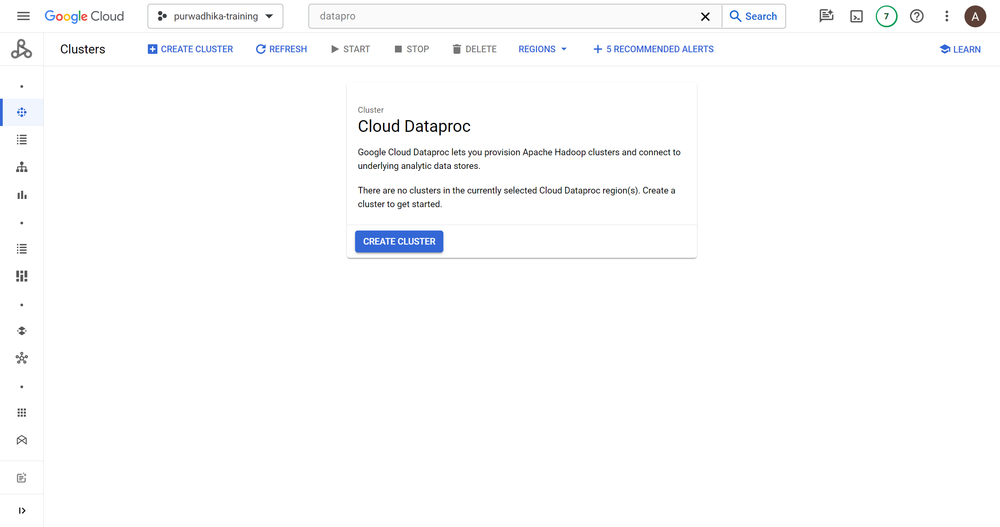
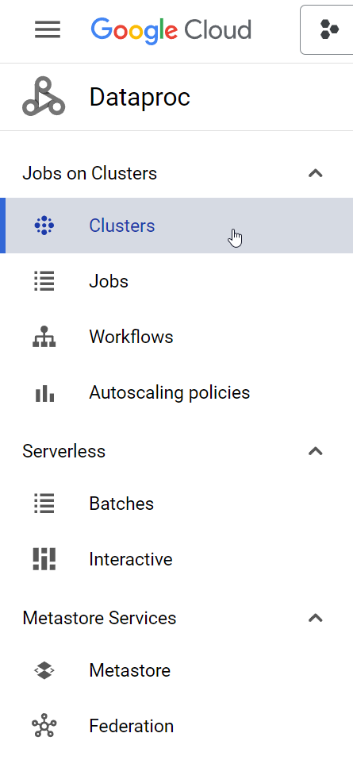
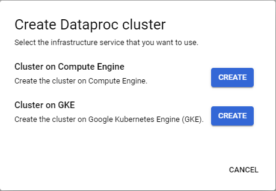
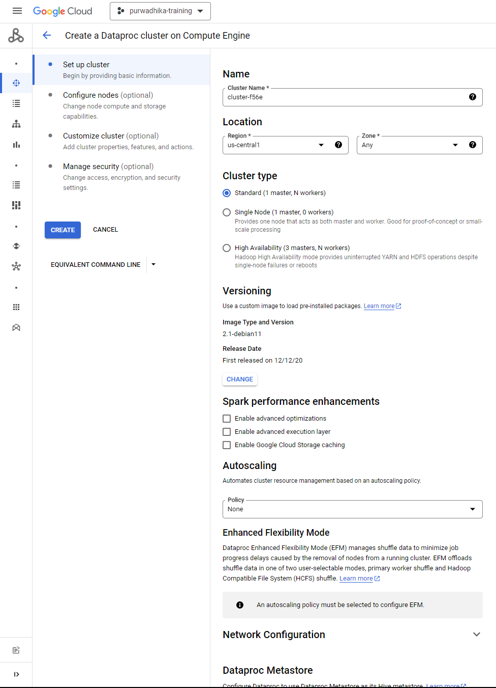
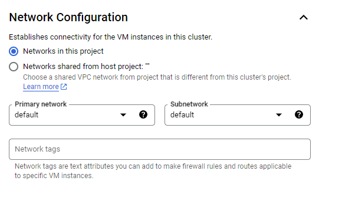
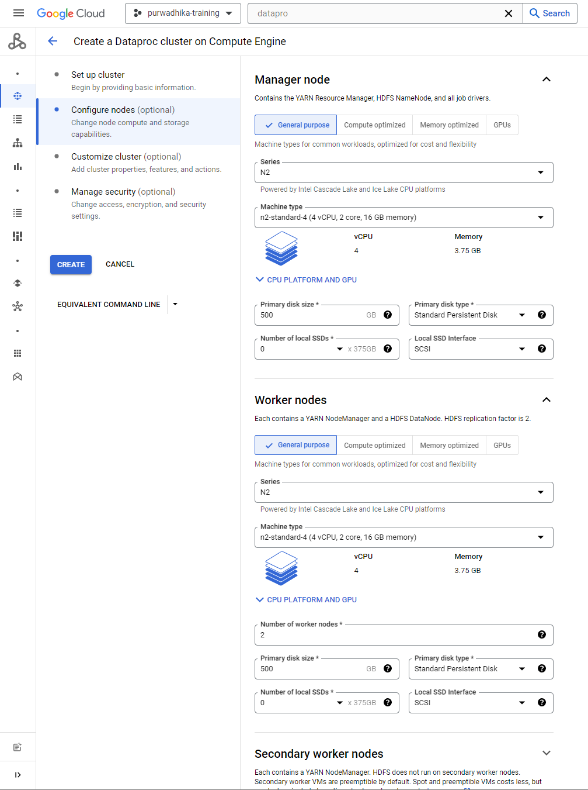
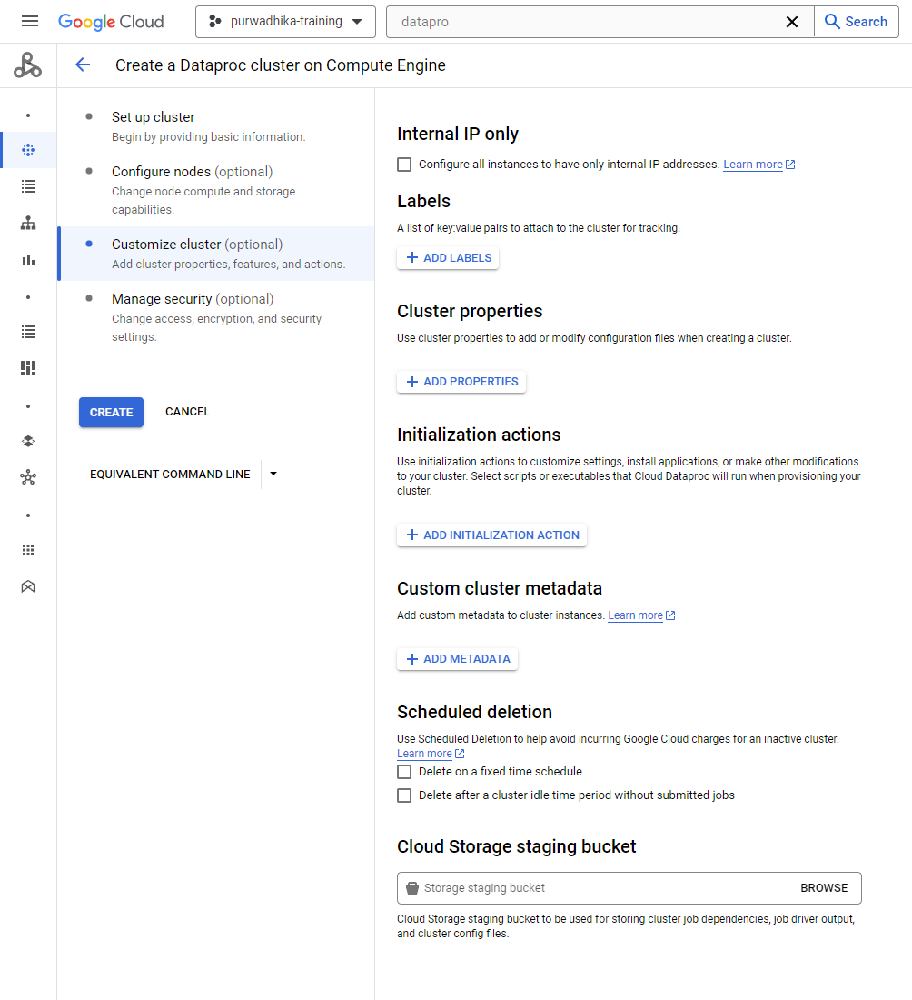
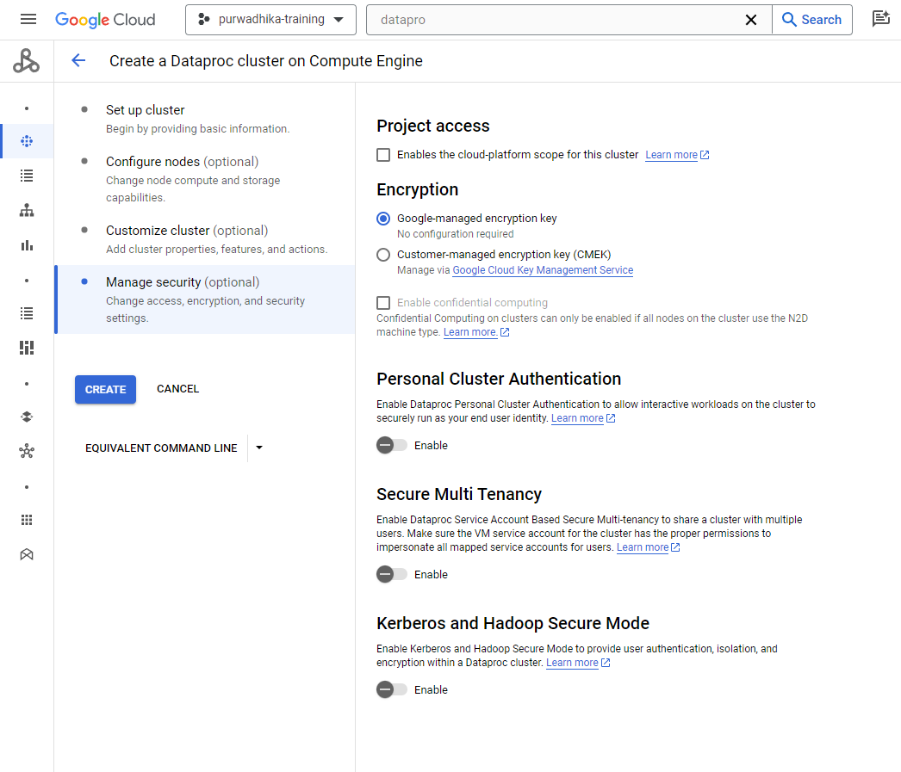

# Provision Dataproc Cluster

For API & Network prerequisites see [here](README.md)

## Create Cluster

- Go to Dataproc page

  

- Make sure `Clusters` is selected on the sidebar

  

- In the clusters page, click `CREATE CLUSTER`. A pop up will appear like below:

  

- Click `CREATE` on `Cluster on Compute Engine`

  

  Fill/Change the following fields (fields not mentioned should be left on default):

  - **Cluster Name**: Leave as is or use whatever unique name

  - **Region**: us-central1

  - **Zone**: Any

  - **Cluster type**: Standard

  - **Network Configuration**: Set `subnetwork` to `default`

    

  - **Components**: Enable component gateway

  - **Optional components**: Enable Jupyter Notebook

- Next click on `Configure nodes`

  

  Fill/Change the following fields:

  - **Manager node**: Change `Machine type` to `n2-standard-2` (2 vCPU, 1 core, 8 GB memory)

  - **Worker nodes**:
  
    - Change `Machine type` to `n2-standard-2`

    - Set `Number of worker nodes` to 2

- Next click on `Customize cluster`:

  

  Fill/Change the following fields:

  - **Cluster properties**: Click on `Add Properties`

    - **Prefix 1**: Choose `dataproc`

    - **Key 1**: Set to `dataproc.scheduler.max-concurrent-jobs`

    - **Value 1**: Set to 2 or 3

- Next click on `Manage security`:

  

  Fill/Change the following fields:

  - **Project access**: Enables the cloud-platform scope for this cluster

- Finally click on `CREATE`
