# Data Processing with Dataproc

## Enable APIs (Don't show to students)

- Dataproc API

  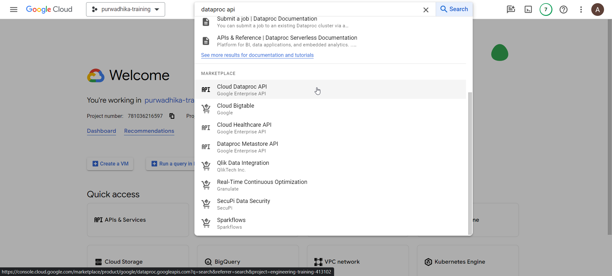

- Click on `ENABLE`

## Configure network connectivity (Don't show to students)

- Go to VPC Networks

  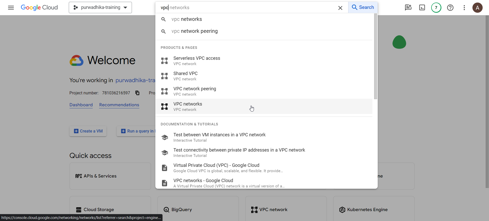

- Click on `default` network

  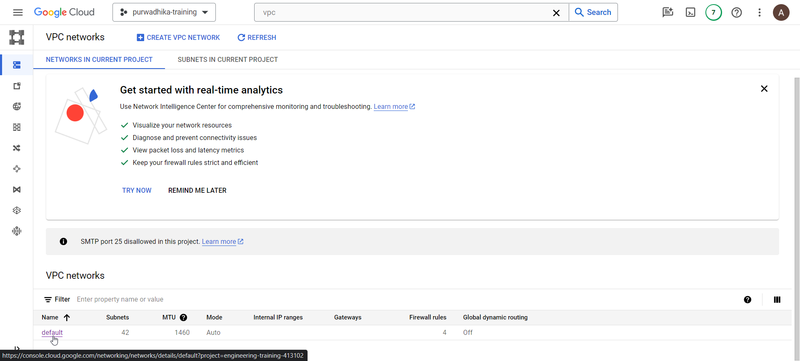

- On the `default` network details, click on `SUBNETS` tab

  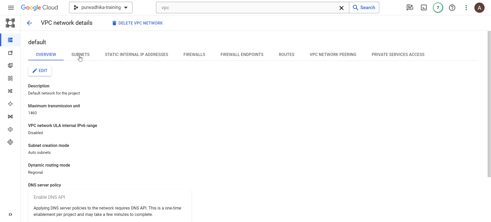

- Look for subnet in the region `asia-southeast2` or other region you want to use for dataproc serverless

  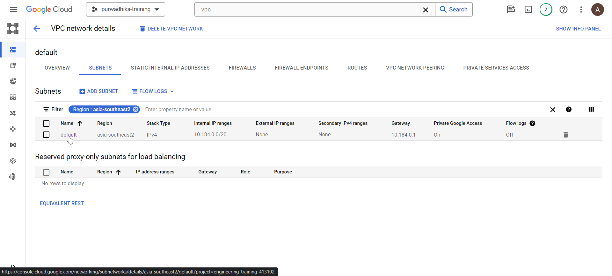

- Click on the `default` subnet and click on `EDIT`

  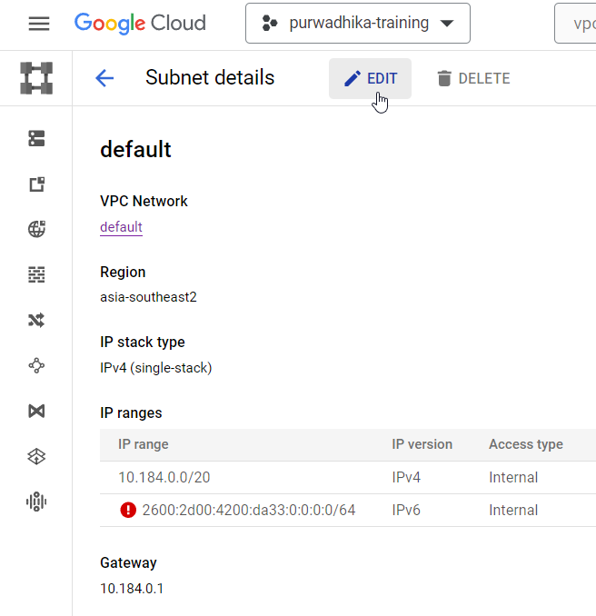

- Enable private google access

  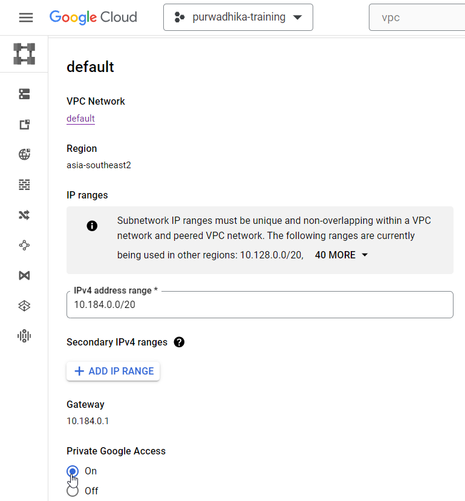

- Save the changes

## Prepare prerequisites

- Make sure git, github cli (gh) and wget is available on your cloud shell

  ```bash
  # check git
  git --version

  # check github CLI
  gh --version

  # check wget
  wget --version
  ```

- If any of the above are not installed, install them with the following

  ```bash
  # install git
  sudo apt-get install git

  # install wget
  sudo apt-get install wget

  # install github cli
  type -p curl >/dev/null || (sudo apt-get update && sudo apt-get install curl -y)
  curl -fsSL https://cli.github.com/packages/githubcli-archive-keyring.gpg | sudo dd of=/usr/share/keyrings/githubcli-archive-keyring.gpg \
  && sudo chmod go+r /usr/share/keyrings/githubcli-archive-keyring.gpg \
  && echo "deb [arch=$(dpkg --print-architecture) signed-by=/usr/share/keyrings/githubcli-archive-keyring.gpg] https://cli.github.com/packages stable main" | sudo tee /etc/apt/sources.list.d/github-cli.list > /dev/null \
  && sudo apt-get update \
  && sudo apt-get install gh -y
  ```

- Authenticate with Github CLI:

  ```bash
  gh auth login
  ```

- You will be getting some prompts

  

  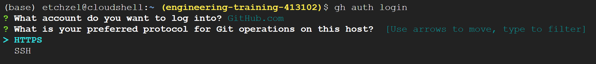

  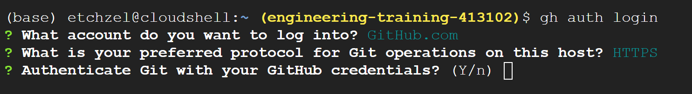

  

  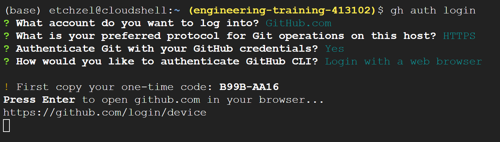

- Open the URL from the prompt on your browser and enter the OTP code

  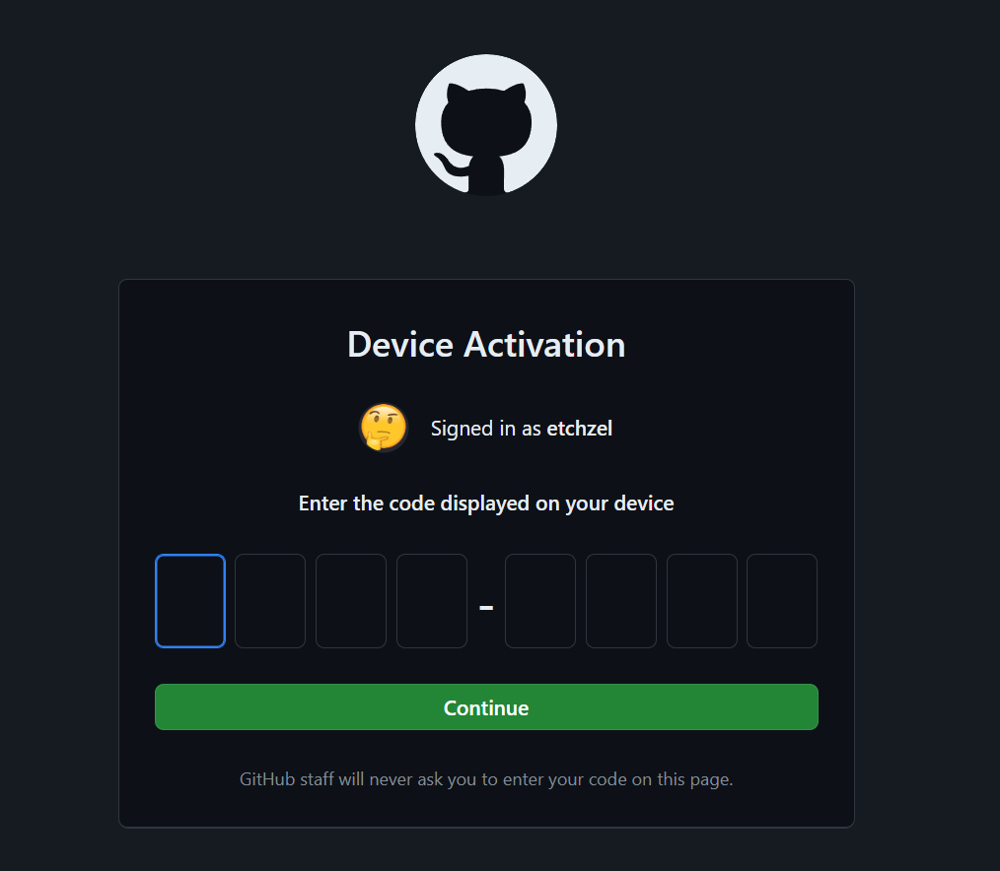

- Next clone the git repo:

  ```bash
  # clone repo
  git clone https://github.com/etchzel/dataproc-batch.git

  # change directory
  cd dataproc-batch
  ```

- Run the script `download_to_gcs.sh` to prepare the data

  ```bash
  # allow execution of script
  chmod +x download_to_gcs.sh

  # execute script to download data
  ./download_to_gcs.sh ~/dataproc-batch gs://trainer_gcs_001/dataproc/input
  ```

  If an auth pop up appears like below, click authorize:

  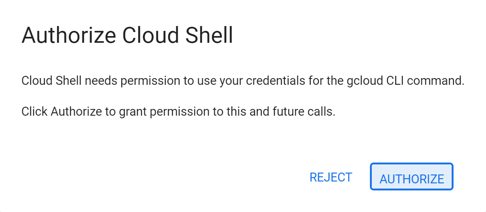

- Next copy the file `spark_job.py` to GCS

  ```bash
  gcloud storage cp spark_job.py gs://trainer_gcs_001/dataproc/spark_job.py
  ```

## Run Spark Job

- In the GCP Console, go to Dataproc page

  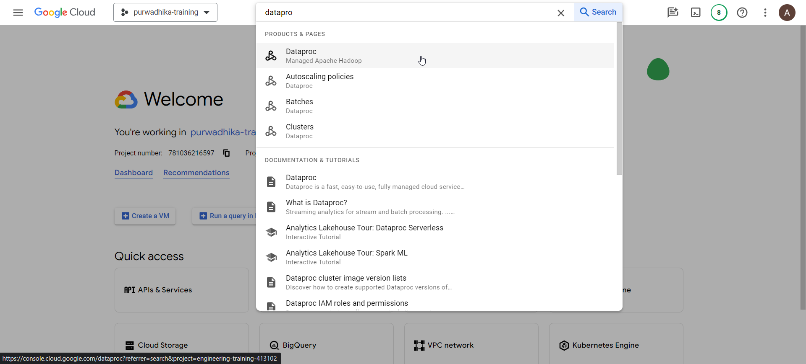

- Expand the sidebar and click on `Jobs`

  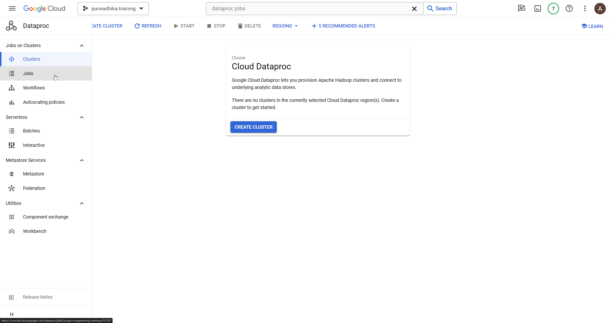

- Click on `Submit Job`

  

- Fill/Change the following fields:

  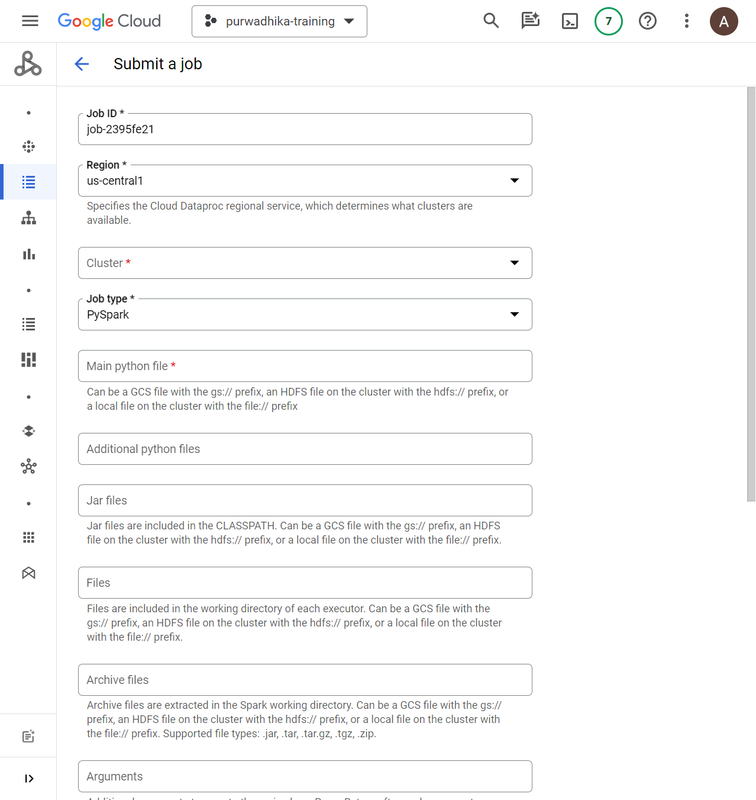

  - **Job ID**: Keep it default as is, or give it a unique naming convention per user

  - **Region**: us-central1

  - **Cluster**: <Cluster ID given by the instructor (once provisioned)>

  - **Job type**: PySpark

  - **Main python file**: GCS Path to spark_job.py example:

    ```bash
    gs://trainer_gcs_001/dataproc/spark_job.py
    ```

  - **Additional python files**: (OPTIONAL) Fill with zip-packaged python dependencies if you want to use external libraries. You can package your dependencies from cloud shell with the following command

  ```bash
  mkdir utils
  
  pip install <pypi-dependencies> <pypi-dependencies> --target=utils/

  cd utils

  zip -r dependencies.zip .

  gcloud storage cp dependencies.zip gs://<user-bucket>/dataproc/dependencies.zip
  ```

  - **Arguments**: Runtime arguments of the spark job, for this particular job, the arguments are:

    ```bash
    --input_green=gs://<user-bucket>/dataproc/input/green_tripdata_*.parquet
    --input_yellow=gs://<user-bucket>/dataproc/input/yellow_tripdata_*.parquet
    --output=<user-dataset>.<bigquery-table-name>
    --temp_bucket=<user-bucket>/dataproc/temp
    --write_mode=overwrite
    ```

    The arguments need to be entered line-by-line. In the job page, it should look like the following image example:

    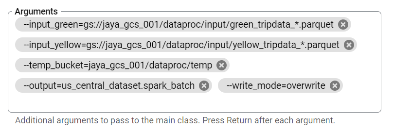

  - Finally click on **SUBMIT**
